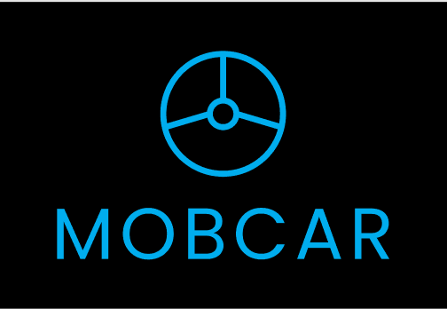

<h1> MobCar</h1>

> Projeto feito como teste para a Empresa Moblize

</br>
<p>Esta aplicação tem como objetivo lista todos os veiculos cadastrados pelo gerente.</p>

<p  align='center'>

</p>

## Instalação

OS X & Linux:

```sh
yarn

# ou caso use npm

npm install
```

## Iniciando a aplicação web

OS X & Linux:

```sh
yarn start

# ou caso use npm

npm start
```

Em seguida abra o seguinte link no seu browser : http://localhost:3000

## Visão Geral

Graças ao design responsivo a aplicação pode ser vista de diversas formas e em diversos contextos

### Web


### Mobile


### Tecnologias

- <a href="https://pt-br.reactjs.org/">ReactJS </a>
- <a href="https://styled-components.com/">Styled Components </a>
- <a href="https://material-ui.com/">MATERIAL-UI </a>
- <a href="https://www.npmjs.com/package/crypto-js">Crypto JS </a>
- <a href="https://react-icons.github.io/react-icons/">React Icons </a>
- <a href="https://reactrouter.com/web/guides/quick-start">React Router DOM </a>
